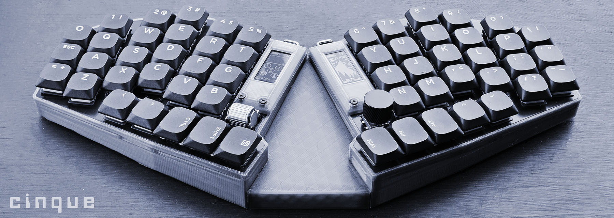

*cinque is an open-source 56-key compact staggered low-profile split ortholinear mechanical RGB keyboard with rotary encoders*

* Keyboard Maintainer: [swaziloo](https://github.com/swaziloo)
* Hardware Supported: cinque v1 (Bluetooth) with NRF52840 ProMicro MCU
  * cinque (likely) works with other ProMicro controllers
* Hardware Availability: [github/swaziloo/cinque](https://github.com/swaziloo/cinque)
* [nice-view-gem](https://github.com/M165437/nice-view-gem) shield designed and shared by [Michael Schmidt-Voigt](https://github.com/M165437)
* [QMK](https://github.com/swaziloo/cinque/blob/main/qmk/cinque/README.md) firmware is recommended for wired/RP2040 builds

## Building the Firmware
You should familiarize yourself with [ZMK Firmware](https://zmk.dev/docs/user-setup).
GitHub workflows build firmware using the main ZMK repository.
Download firmware from your repository under `Actions->[Your Commit Message]->firmware` 
It will be packaged in a .zip file containing separate `.uf2` files for the left and right halves.

## Flashing
Attach a USB cable and double tap the reset (RST) button on your MCU or board. 
The ProMicro will connect as a USB drive into which you drop the `.uf2` file you just built.
The ProMicro will reconnect as a keyboard once it installs the firmware. 
Connect and flash both MCUs independently.

cinque is licensed under an [MIT License](LICENSE).
